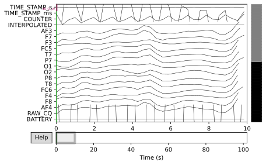
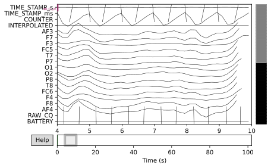
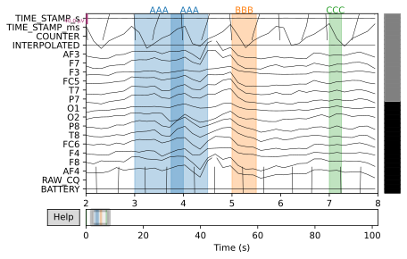
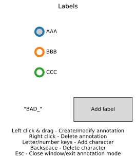
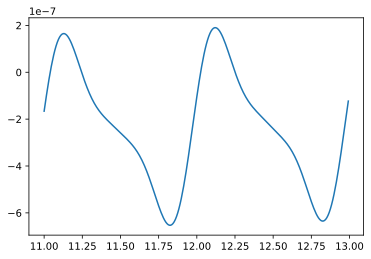

##MNE COLAB

<a href="https://colab.research.google.com/github/muhammed-bayat/mneTest/blob/main/edfView.ipynb" target="_parent"></a>


```python
!pip install mne
```

    Requirement already satisfied: mne in c:\programdata\anaconda3\lib\site-packages (0.21.2)
    Requirement already satisfied: numpy>=1.11.3 in c:\programdata\anaconda3\lib\site-packages (from mne) (1.19.2)
    Requirement already satisfied: scipy>=0.17.1 in c:\programdata\anaconda3\lib\site-packages (from mne) (1.5.2)
    


```python
#from google.colab import drive google drive dataset kullanmak için
```


```python
# drive.mount('/gdrive') colab gdrive konumu baglandı
```


```python
import mne
```


```python
import webbrowser
webbrowser.open("https://mne.tools/dev/generated/mne.io.Raw.html", new=0, autoraise=True)
#DOC
```


    True


```python
import matplotlib as plt
```


```python
# cd /gdrive/MyDrive/Colab\ Notebooks/sinyaller/beyza.edf gdrive dataset konumu 
```


```python
cd datasets/
```

    [WinError 2] The system cannot find the file specified: 'datasets/'
    c:\Users\clayos\Documents\GitHub\mneTest\datasets
    


```python
ls
```

     Volume in drive C has no label.
     Volume Serial Number is 24D0-D19E
    
     Directory of c:\Users\clayos\Documents\GitHub\mneTest\datasets
    
    12/13/2020  02:21 PM    <DIR>          .
    12/13/2020  02:21 PM    <DIR>          ..
    12/13/2020  01:40 PM            95,232 beyza.edf
    12/13/2020  01:40 PM             1,336 beyza.json
    12/13/2020  01:52 PM         1,081,344 beyzaedf.edf
                   3 File(s)      1,177,912 bytes
                   2 Dir(s)  161,207,173,120 bytes free
    


```python
fname="beyza.edf"
```


```python
raw=mne.io.read_raw_edf(fname)
```

    Extracting EDF parameters from c:\Users\clayos\Documents\GitHub\mneTest\datasets\beyza.edf...
    EDF file detected
    Setting channel info structure...
    Creating raw.info structure...
    


```python
dir(raw)
```


    ['__class__',
     '__contains__',
     '__del__',
     '__delattr__',
     '__dict__',
     '__dir__',
     '__doc__',
     '__enter__',
     '__eq__',
     '__exit__',
     '__format__',
     '__ge__',
     '__getattribute__',
     '__getitem__',
     '__gt__',
     '__hash__',
     '__init__',
     '__init_subclass__',
     '__le__',
     '__len__',
     '__lt__',
     '__module__',
     '__ne__',
     '__new__',
     '__reduce__',
     '__reduce_ex__',
     '__repr__',
     '__setattr__',
     '__setitem__',
     '__sizeof__',
     '__slotnames__',
     '__str__',
     '__subclasshook__',
     '__weakref__',
     '_annotations',
     '_cals',
     '_check_bad_segment',
     '_comp',
     '_data',
     '_dtype',
     '_dtype_',
     '_filenames',
     '_first_samps',
     '_first_time',
     '_get_buffer_size',
     '_get_channel_positions',
     '_init_kwargs',
     '_last_samps',
     '_last_time',
     '_orig_units',
     '_parse_get_set_params',
     '_pick_drop_channels',
     '_pick_projs',
     '_preload_data',
     '_projector',
     '_projectors',
     '_raw_extras',
     '_raw_lengths',
     '_read_comp_grade',
     '_read_picks',
     '_read_segment',
     '_read_segment_file',
     '_reconstruct_proj',
     '_set_channel_positions',
     '_size',
     '_times',
     '_tmin_tmax_to_start_stop',
     '_update_times',
     'add_channels',
     'add_events',
     'add_proj',
     'annotations',
     'anonymize',
     'append',
     'apply_function',
     'apply_gradient_compensation',
     'apply_hilbert',
     'apply_proj',
     'buffer_size_sec',
     'ch_names',
     'close',
     'compensation_grade',
     'copy',
     'crop',
     'del_proj',
     'drop_channels',
     'filenames',
     'filter',
     'first_samp',
     'first_time',
     'get_channel_types',
     'get_data',
     'get_montage',
     'info',
     'interpolate_bads',
     'last_samp',
     'load_bad_channels',
     'load_data',
     'n_times',
     'notch_filter',
     'orig_format',
     'pick',
     'pick_channels',
     'pick_types',
     'plot',
     'plot_projs_topomap',
     'plot_psd',
     'plot_psd_topo',
     'plot_sensors',
     'preload',
     'proj',
     'rename_channels',
     'reorder_channels',
     'resample',
     'save',
     'savgol_filter',
     'set_annotations',
     'set_channel_types',
     'set_eeg_reference',
     'set_meas_date',
     'set_montage',
     'time_as_index',
     'times',
     'to_data_frame',
     'verbose']


```python
raw=mne.io.read_raw_edf(fname,preload=True)
```


```python
#raw.filter?  google colab
```


      File "<ipython-input-160-27c1f2f64413>", line 1
        raw.filter?
                  ^
    SyntaxError: invalid syntax
    


```python
raw.plot() #matplot ile grafik çizildi.
```


```python
fname="beyzaedf.edf" #2 edf dosyası olduğu için her ikisinin grafiğini görmek istersek
raw=mne.io.read_raw_edf(fname)
raw=mne.io.read_raw_edf(fname,preload=True)
```

    Extracting EDF parameters from c:\Users\clayos\Documents\GitHub\mneTest\datasets\beyzaedf.edf...
    EDF file detected
    Setting channel info structure...
    Creating raw.info structure...
    Extracting EDF parameters from c:\Users\clayos\Documents\GitHub\mneTest\datasets\beyzaedf.edf...
    EDF file detected
    Setting channel info structure...
    Creating raw.info structure...
    Reading 0 ... 13055  =      0.000 ...   101.992 secs...
    


```python
raw.filter(0.0194,2.10) #istenen edf filitreleme setting up band-pass filter from 1 - 3 Hz
raw.plot() # flitreledikten sonra grafiği çiz
```

    Filtering raw data in 1 contiguous segment
    Setting up band-pass filter from 0.019 - 2.1 Hz
    
    FIR filter parameters
    ---------------------
    Designing a one-pass, zero-phase, non-causal bandpass filter:
    - Windowed time-domain design (firwin) method
    - Hamming window with 0.0194 passband ripple and 53 dB stopband attenuation
    - Lower passband edge: 0.02
    - Lower transition bandwidth: 0.02 Hz (-6 dB cutoff frequency: 0.01 Hz)
    - Upper passband edge: 2.10 Hz
    - Upper transition bandwidth: 2.00 Hz (-6 dB cutoff frequency: 3.10 Hz)
    - Filter length: 21775 samples (170.117 sec)
    
    


    

    


    

    


```python
ica=mne.preprocessing.ICA(n_components=20, random_state=0)
```


```python
from matplotlib import pyplot as plt
 
raw.info
```


    <Info | 9 non-empty values
     bads: []
     ch_names: TIME_STAMP_s, TIME_STAMP_ms, COUNTER, INTERPOLATED, AF3, F7, F3, ...
     chs: 41 EEG
     custom_ref_applied: False
     description: Anonymized using a time shift to preserve age at acquisition
     experimenter: mne_anonymize
     highpass: 0.0 Hz
     lowpass: 2.1 Hz
     meas_date: 2000-01-01 00:00:00 UTC
     nchan: 41
     projs: []
     sfreq: 128.0 Hz
    >


```python
raw.save("ilkveri.png")
```

    Writing C:\Users\clayos\Documents\GitHub\mneTest\datasets\ilkveri.png
    Closing C:\Users\clayos\Documents\GitHub\mneTest\datasets\ilkveri.png
    [done]
    


```python
raw.plot(block=True,lowpass=1)
```

    Setting up low-pass filter at 1 Hz
    
    IIR filter parameters
    ---------------------
    Butterworth lowpass zero-phase (two-pass forward and reverse) non-causal filter:
    - Filter order 8 (effective, after forward-backward)
    - Cutoff at 1.00 Hz: -6.02 dB
    
    


    

    


    

    


```python
raw.plot(block=True,lowpass=2,start=, duration=6)
```

    Setting up low-pass filter at 2 Hz
    
    IIR filter parameters
    ---------------------
    Butterworth lowpass zero-phase (two-pass forward and reverse) non-causal filter:
    - Filter order 8 (effective, after forward-backward)
    - Cutoff at 2.00 Hz: -6.02 dB
    
    


    

    


    

    


```python
my_annot = mne.Annotations(onset=[3, 5, 7],
                           duration=[1, 0.5, 0.25],
                           description=['AAA', 'BBB', 'CCC'])
```


```python
new_annot = mne.Annotations(onset=3.75, duration=0.75, description='AAA')
raw.set_annotations(my_annot + new_annot)
raw.plot(start=2, duration=6)
```


    

    


    

    


```python
fig= raw.plot(start=2, duration=6)
fig.canvas.key_press_event('a')
```


    

    


    

    


```python
import numpy as np

sampling_freq = raw.info['sfreq']
start_stop_seconds = np.array([11, 13])
start_sample, stop_sample = (start_stop_seconds * sampling_freq).astype(int)
channel_index = 0
raw_selection = raw[channel_index, start_sample:stop_sample]
print(raw_selection)

```

    (array([[-1.66018595e-07, -1.30724861e-07, -9.64628222e-08,
            -6.35038392e-08, -3.21020838e-08, -2.49133328e-09,
             2.51178940e-08,  5.05408143e-08,  7.36204262e-08,
             9.42291013e-08,  1.12269696e-07,  1.27676169e-07,
             1.40413709e-07,  1.50478366e-07,  1.57896212e-07,
             1.62722050e-07,  1.65037700e-07,  1.64949906e-07,
             1.62587907e-07,  1.58100721e-07,  1.51654197e-07,
             1.43427901e-07,  1.33611884e-07,  1.22403405e-07,
             1.10003660e-07,  9.66145877e-08,  8.24357961e-08,
             6.76616712e-08,  5.24787117e-08,  3.70631332e-08,
             2.15787754e-08,  6.17534123e-09, -9.01301053e-09,
            -2.38687090e-08, -3.82914444e-08, -5.21984754e-08,
            -6.55245809e-08, -7.82216750e-08, -9.02581088e-08,
            -1.01617692e-07, -1.12298467e-07, -1.22311281e-07,
            -1.31678192e-07, -1.40430756e-07, -1.48608266e-07,
            -1.56255934e-07, -1.63423117e-07, -1.70161601e-07,
            -1.76523992e-07, -1.82562249e-07, -1.88326388e-07,
            -1.93863389e-07, -1.99216313e-07, -2.04423654e-07,
            -2.09518930e-07, -2.14530508e-07, -2.19481661e-07,
            -2.24390844e-07, -2.29272162e-07, -2.34136025e-07,
            -2.38989932e-07, -2.43839384e-07, -2.48688858e-07,
            -2.53542833e-07, -2.58406810e-07, -2.63288290e-07,
            -2.68197684e-07, -2.73149101e-07, -2.78160998e-07,
            -2.83256651e-07, -2.88464431e-07, -2.93817859e-07,
            -2.99355434e-07, -3.05120222e-07, -3.11159205e-07,
            -3.17522405e-07, -3.24261784e-07, -3.31429954e-07,
            -3.39078704e-07, -3.47257394e-07, -3.56011241e-07,
            -3.65379537e-07, -3.75393842e-07, -3.86076216e-07,
            -3.97437507e-07, -4.09475757e-07, -4.22174777e-07,
            -4.35502916e-07, -4.49412088e-07, -4.63837070e-07,
            -4.78695118e-07, -4.93885920e-07, -5.09291902e-07,
            -5.24778902e-07, -5.40197213e-07, -5.55382992e-07,
            -5.70160019e-07, -5.84341791e-07, -5.97733918e-07,
            -6.10136788e-07, -6.21348460e-07, -6.31167731e-07,
            -6.39397340e-07, -6.45847234e-07, -6.50337843e-07,
            -6.52703316e-07, -6.52794632e-07, -6.50482551e-07,
            -6.45660328e-07, -6.38246141e-07, -6.28185186e-07,
            -6.15451392e-07, -6.00048708e-07, -5.82011947e-07,
            -5.61407149e-07, -5.38331458e-07, -5.12912505e-07,
            -4.85307290e-07, -4.55700598e-07, -4.24302948e-07,
            -3.91348118e-07, -3.57090281e-07, -3.21800795e-07,
            -2.85764713e-07, -2.49277044e-07, -2.12638860e-07,
            -1.76153303e-07, -1.40121513e-07, -1.04838640e-07,
            -7.05899287e-08, -3.76469835e-08, -6.26425331e-09,
             2.33241924e-08,  5.09075474e-08,  7.63007655e-08,
             9.93466304e-08,  1.19917369e-07,  1.37915785e-07,
             1.53275897e-07,  1.65963082e-07,  1.75973727e-07,
             1.83334393e-07,  1.88100541e-07,  1.90354811e-07,
             1.90204934e-07,  1.87781287e-07,  1.83234168e-07,
             1.76730829e-07,  1.68452328e-07,  1.58590277e-07,
             1.47343521e-07,  1.34914830e-07,  1.21507662e-07,
             1.07323043e-07,  9.25566278e-08,  7.73959880e-08,
             6.20181691e-08,  4.65875539e-08,  3.12540613e-08,
             1.61517024e-08,  1.39750863e-09, -1.29091641e-08,
            -2.66869552e-08, -3.98724553e-08, -5.24198137e-08,
            -6.43000226e-08, -7.54999094e-08, -8.60208705e-08,
            -9.58773894e-08, -1.05095382e-07, -1.13710411e-07,
            -1.21765839e-07, -1.29310925e-07, -1.36398952e-07,
            -1.43085412e-07, -1.49426294e-07, -1.55476514e-07,
            -1.61288522e-07, -1.66911109e-07, -1.72388440e-07,
            -1.77759332e-07, -1.83056775e-07, -1.88307707e-07,
            -1.93533045e-07, -1.98747937e-07, -2.03962246e-07,
            -2.09181225e-07, -2.14406357e-07, -2.19636334e-07,
            -2.24868132e-07, -2.30098150e-07, -2.35323366e-07,
            -2.40542474e-07, -2.45756959e-07, -2.50972077e-07,
            -2.56197693e-07, -2.61448963e-07, -2.66746805e-07,
            -2.72118165e-07, -2.77596039e-07, -2.83219248e-07,
            -2.89031963e-07, -2.95082982e-07, -3.01424761e-07,
            -3.08112222e-07, -3.15201359e-07, -3.22747668e-07,
            -3.30804436e-07, -3.39420928e-07, -3.48640508e-07,
            -3.58498741e-07, -3.69021544e-07, -3.80223402e-07,
            -3.92105710e-07, -4.04655295e-07, -4.17843148e-07,
            -4.31623414e-07, -4.45932683e-07, -4.60689588e-07,
            -4.75794770e-07, -4.91131193e-07, -5.06564839e-07,
            -5.21945785e-07, -5.37109642e-07, -5.51879358e-07,
            -5.66067356e-07, -5.79477976e-07, -5.91910185e-07,
            -6.03160522e-07, -6.13026209e-07, -6.21308399e-07,
            -6.27815476e-07, -6.32366377e-07, -6.34793848e-07,
            -6.34947590e-07, -6.32697222e-07, -6.27935014e-07,
            -6.20578324e-07, -6.10571693e-07, -5.97888557e-07,
            -5.82532533e-07, -5.64538243e-07, -5.43971671e-07,
            -5.20930014e-07, -4.95541047e-07, -4.67961988e-07,
            -4.38377884e-07, -4.06999543e-07, -3.74061035e-07,
            -3.39816810e-07, -3.04538472e-07, -2.68511268e-07,
            -2.32030345e-07, -1.95396844e-07, -1.58913906e-07,
            -1.22882601e-07]]), array([11.       , 11.0078125, 11.015625 , 11.0234375, 11.03125  ,
           11.0390625, 11.046875 , 11.0546875, 11.0625   , 11.0703125,
           11.078125 , 11.0859375, 11.09375  , 11.1015625, 11.109375 ,
           11.1171875, 11.125    , 11.1328125, 11.140625 , 11.1484375,
           11.15625  , 11.1640625, 11.171875 , 11.1796875, 11.1875   ,
           11.1953125, 11.203125 , 11.2109375, 11.21875  , 11.2265625,
           11.234375 , 11.2421875, 11.25     , 11.2578125, 11.265625 ,
           11.2734375, 11.28125  , 11.2890625, 11.296875 , 11.3046875,
           11.3125   , 11.3203125, 11.328125 , 11.3359375, 11.34375  ,
           11.3515625, 11.359375 , 11.3671875, 11.375    , 11.3828125,
           11.390625 , 11.3984375, 11.40625  , 11.4140625, 11.421875 ,
           11.4296875, 11.4375   , 11.4453125, 11.453125 , 11.4609375,
           11.46875  , 11.4765625, 11.484375 , 11.4921875, 11.5      ,
           11.5078125, 11.515625 , 11.5234375, 11.53125  , 11.5390625,
           11.546875 , 11.5546875, 11.5625   , 11.5703125, 11.578125 ,
           11.5859375, 11.59375  , 11.6015625, 11.609375 , 11.6171875,
           11.625    , 11.6328125, 11.640625 , 11.6484375, 11.65625  ,
           11.6640625, 11.671875 , 11.6796875, 11.6875   , 11.6953125,
           11.703125 , 11.7109375, 11.71875  , 11.7265625, 11.734375 ,
           11.7421875, 11.75     , 11.7578125, 11.765625 , 11.7734375,
           11.78125  , 11.7890625, 11.796875 , 11.8046875, 11.8125   ,
           11.8203125, 11.828125 , 11.8359375, 11.84375  , 11.8515625,
           11.859375 , 11.8671875, 11.875    , 11.8828125, 11.890625 ,
           11.8984375, 11.90625  , 11.9140625, 11.921875 , 11.9296875,
           11.9375   , 11.9453125, 11.953125 , 11.9609375, 11.96875  ,
           11.9765625, 11.984375 , 11.9921875, 12.       , 12.0078125,
           12.015625 , 12.0234375, 12.03125  , 12.0390625, 12.046875 ,
           12.0546875, 12.0625   , 12.0703125, 12.078125 , 12.0859375,
           12.09375  , 12.1015625, 12.109375 , 12.1171875, 12.125    ,
           12.1328125, 12.140625 , 12.1484375, 12.15625  , 12.1640625,
           12.171875 , 12.1796875, 12.1875   , 12.1953125, 12.203125 ,
           12.2109375, 12.21875  , 12.2265625, 12.234375 , 12.2421875,
           12.25     , 12.2578125, 12.265625 , 12.2734375, 12.28125  ,
           12.2890625, 12.296875 , 12.3046875, 12.3125   , 12.3203125,
           12.328125 , 12.3359375, 12.34375  , 12.3515625, 12.359375 ,
           12.3671875, 12.375    , 12.3828125, 12.390625 , 12.3984375,
           12.40625  , 12.4140625, 12.421875 , 12.4296875, 12.4375   ,
           12.4453125, 12.453125 , 12.4609375, 12.46875  , 12.4765625,
           12.484375 , 12.4921875, 12.5      , 12.5078125, 12.515625 ,
           12.5234375, 12.53125  , 12.5390625, 12.546875 , 12.5546875,
           12.5625   , 12.5703125, 12.578125 , 12.5859375, 12.59375  ,
           12.6015625, 12.609375 , 12.6171875, 12.625    , 12.6328125,
           12.640625 , 12.6484375, 12.65625  , 12.6640625, 12.671875 ,
           12.6796875, 12.6875   , 12.6953125, 12.703125 , 12.7109375,
           12.71875  , 12.7265625, 12.734375 , 12.7421875, 12.75     ,
           12.7578125, 12.765625 , 12.7734375, 12.78125  , 12.7890625,
           12.796875 , 12.8046875, 12.8125   , 12.8203125, 12.828125 ,
           12.8359375, 12.84375  , 12.8515625, 12.859375 , 12.8671875,
           12.875    , 12.8828125, 12.890625 , 12.8984375, 12.90625  ,
           12.9140625, 12.921875 , 12.9296875, 12.9375   , 12.9453125,
           12.953125 , 12.9609375, 12.96875  , 12.9765625, 12.984375 ,
           12.9921875]))
    


```python
x = raw_selection[1]
y = raw_selection[0].T
plt.plot(x, y)
```


    [<matplotlib.lines.Line2D at 0x27c70476e80>]


    

    


```python
ica=mne.preprocessing.ICA(n_components=20, random_state=0)
mne.find_events?
```

    Signature:
    mne.find_events(
        raw,
        stim_channel=None,
        output='onset',
        consecutive='increasing',
        min_duration=0,
        shortest_event=2,
        mask=None,
        uint_cast=False,
        mask_type='and',
        initial_event=False,
        verbose=None,
    )
    Docstring:
    Find events from raw file.
    
    See :ref:`tut-events-vs-annotations` and :ref:`tut-event-arrays`
    for more information about events.
    
    Parameters
    ----------
    raw : Raw object
        The raw data.
    stim_channel : None | str | list of str
        Name of the stim channel or all the stim channels
        affected by triggers. If None, the config variables
        'MNE_STIM_CHANNEL', 'MNE_STIM_CHANNEL_1', 'MNE_STIM_CHANNEL_2',
        etc. are read. If these are not found, it will fall back to
        'STI 014' if present, then fall back to the first channel of type
        'stim', if present. If multiple channels are provided
        then the returned events are the union of all the events
        extracted from individual stim channels.
    output : 'onset' | 'offset' | 'step'
        Whether to report when events start, when events end, or both.
    consecutive : bool | 'increasing'
        If True, consider instances where the value of the events
        channel changes without first returning to zero as multiple
        events. If False, report only instances where the value of the
        events channel changes from/to zero. If 'increasing', report
        adjacent events only when the second event code is greater than
        the first.
    min_duration : float
        The minimum duration of a change in the events channel required
        to consider it as an event (in seconds).
    shortest_event : int
        Minimum number of samples an event must last (default is 2). If the
        duration is less than this an exception will be raised.
    mask : int | None
        The value of the digital mask to apply to the stim channel values.
        If None (default), no masking is performed.
    uint_cast : bool
        If True (default False), do a cast to ``uint16`` on the channel
        data. This can be used to fix a bug with STI101 and STI014 in
        Neuromag acquisition setups that use channel STI016 (channel 16
        turns data into e.g. -32768), similar to ``mne_fix_stim14 --32``
        in MNE-C.
    
        .. versionadded:: 0.12
    mask_type : 'and' | 'not_and'
        The type of operation between the mask and the trigger.
        Choose 'and' (default) for MNE-C masking behavior.
    
        .. versionadded:: 0.13
    initial_event : bool
        If True (default False), an event is created if the stim channel has a
        value different from 0 as its first sample. This is useful if an event
        at t=0s is present.
    
        .. versionadded:: 0.16
    
    verbose : bool, str, int, or None
        If not None, override default verbose level (see :func:`mne.verbose`
        and :ref:`Logging documentation <tut_logging>` for more).
        If used, it should be passed as a keyword-argument only.
    
    Returns
    -------
    events : array, shape = (n_events, 3)
        All events that were found. The first column contains the event time
        in samples and the third column contains the event id. For output =
        'onset' or 'step', the second column contains the value of the stim
        channel immediately before the event/step. For output = 'offset',
        the second column contains the value of the stim channel after the
        event offset.
    
    See Also
    --------
    find_stim_steps : Find all the steps in the stim channel.
    read_events : Read events from disk.
    write_events : Write events to disk.
    
    Notes
    -----
    .. warning:: If you are working with downsampled data, events computed
                 before decimation are no longer valid. Please recompute
                 your events after decimation, but note this reduces the
                 precision of event timing.
    
    Examples
    --------
    Consider data with a stim channel that looks like::
    
        [0, 32, 32, 33, 32, 0]
    
    By default, find_events returns all samples at which the value of the
    stim channel increases::
    
        >>> print(find_events(raw)) # doctest: +SKIP
        [[ 1  0 32]
         [ 3 32 33]]
    
    If consecutive is False, find_events only returns the samples at which
    the stim channel changes from zero to a non-zero value::
    
        >>> print(find_events(raw, consecutive=False)) # doctest: +SKIP
        [[ 1  0 32]]
    
    If consecutive is True, find_events returns samples at which the
    event changes, regardless of whether it first returns to zero::
    
        >>> print(find_events(raw, consecutive=True)) # doctest: +SKIP
        [[ 1  0 32]
         [ 3 32 33]
         [ 4 33 32]]
    
    If output is 'offset', find_events returns the last sample of each event
    instead of the first one::
    
        >>> print(find_events(raw, consecutive=True, # doctest: +SKIP
        ...                   output='offset'))
        [[ 2 33 32]
         [ 3 32 33]
         [ 4  0 32]]
    
    If output is 'step', find_events returns the samples at which an event
    starts or ends::
    
        >>> print(find_events(raw, consecutive=True, # doctest: +SKIP
        ...                   output='step'))
        [[ 1  0 32]
         [ 3 32 33]
         [ 4 33 32]
         [ 5 32  0]]
    
    To ignore spurious events, it is also possible to specify a minimum
    event duration. Assuming our events channel has a sample rate of
    1000 Hz::
    
        >>> print(find_events(raw, consecutive=True, # doctest: +SKIP
        ...                   min_duration=0.002))
        [[ 1  0 32]]
    
    For the digital mask, if mask_type is set to 'and' it will take the
    binary representation of the digital mask, e.g. 5 -> '00000101', and will
    allow the values to pass where mask is one, e.g.::
    
              7 '0000111' <- trigger value
             37 '0100101' <- mask
         ----------------
              5 '0000101'
    
    For the digital mask, if mask_type is set to 'not_and' it will take the
    binary representation of the digital mask, e.g. 5 -> '00000101', and will
    block the values where mask is one, e.g.::
    
              7 '0000111' <- trigger value
             37 '0100101' <- mask
         ----------------
              2 '0000010'
    File:      c:\programdata\anaconda3\lib\site-packages\mne\event.py
    Type:      function
    


```python
pip install json_viewer

```

    Processing c:\users\clayos\appdata\local\pip\cache\wheels\2e\44\7b\8e700fde385842a835342722cd3e3b4e4132208e3578a67858\json_viewer-0.1.3-py3-none-any.whlNote: you may need to restart the kernel to use updated packages.
    Collecting PyQt5
      Using cached PyQt5-5.15.2-5.15.2-cp35.cp36.cp37.cp38.cp39-none-win_amd64.whl (56.9 MB)
    Requirement already satisfied: PyQt5-sip in c:\programdata\anaconda3\lib\site-packages (from json_viewer) (12.8.1)
    Installing collected packages: PyQt5, json-viewer
    
    ERROR: Could not install packages due to an EnvironmentError: [WinError 5] Access is denied: 'C:\\ProgramData\\Anaconda3\\Lib\\site-packages\\PyQt5\\Qt.pyd'
    Consider using the `--user` option or check the permissions.
    
    


## MNE-Python

```sh
$ conda --version && python --version
conda 4.9.2
Python 3.8.5 :: Anaconda, Inc.
$  which python
/home/user/anaconda3/bin/python
 $ which pip
/home/user/anaconda3/bin/pip
```

## LINUX 
```
$ curl --remote-name https://raw.githubusercontent.com/mne-tools/mne-python/master/environment.yml
$ conda env update --file environment.yml
```

#### To activate this environment, use

#####  $  ```conda activate mne```

#### To deactivate an active environment, use

#####   $ ```conda deactivate```


## WINDOWS
Download the environment [file](https://raw.githubusercontent.com/mne-tools/mne-python/master/environment.yml)

Open an Anaconda command prompt

Run ```conda install --name base nb_conda_kernels```

cd to the directory where you downloaded the file

Run ``` 
conda env update --file environment.yml```


### If you see an error like:

```  Traceback (most recent call last):
  File "<string>", line 1, in <module>
ModuleNotFoundError: No module named 'mne' ```  
``` 
This suggests that your environment containing MNE-Python is not active. If you followed the setup for 3D plotting/source analysis (i.e., you installed to a new mne environment instead of the base environment) try running conda activate mne first, and try again. If this works, you might want to set your terminal to automatically activate the mne environment each time you open a terminal:  

 ```  echo conda activate mne >> ~/.bashrc    # for bash shells``` 

 ``` echo conda activate mne >> ~/.zprofile  # for zsh shells``` 
## Contributors ✨

 
<!-- ALL-CONTRIBUTORS-LIST:START - Do not remove or modify this section -->
<!-- prettier-ignore-start -->
<!-- markdownlint-disable -->
<table>
  <tr>
    <td align="center"><a href="https://www.xraph.com"><br /><sub><b>Muhammed Bayat</b></sub></a><br /><a href="https://github.com/muhammed-bayat" title="Code">💻</a> 
  >
  </tr>
</table>

<!-- markdownlint-enable -->
<!-- prettier-ignore-end -->
<!-- ALL-CONTRIBUTORS-LIST:END -->

 Contributions of any kind welcome!
